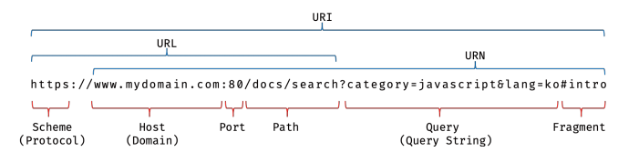

# 21. 빌트인 객체
## 21.1 자바스크립트 객체의 분류

| 표준 빌트인 객체<br>standard built-in objects<br>native objects<br>global objects | 호스트 객체<br>host objects                                                                                                                                                                                 | 사용자 정의 객체<br>user-defined objects |
|:---------------------------------------------------------------------------|:-------------------------------------------------------------------------------------------------------------------------------------------------------------------------------------------------------|:----------------------------------|
| ECMAScript사양에 정의된 객체<br>애플리케이션 전역의 공통 기능을 제공                               | ECMAScript 사양X<br>자바스크립트 실행 환경에서 추가로 제공하는 객체<br>(자바스크립트 실행환경: 브라우저/Node.js)                                                                                                                            | 사용자가 직접 정의한 객체                    |
| Javascript 실행 환경과 관계없이 언제나 사용 가능                                           | 브라우저 환경이 제공하는 호스트 객체: 클라이언트 사이트 Web API<br>(예: DOM, BOM, Canvas, XMLHttpRequest, fetch, requestAnimationFrame, SVG, Web Storage, Web Component, Web Worker)<br>Node.js 환경이 제공하는 호스트 객체: Node.js 고유 API |                                   |
| 전역 객체의 프로퍼티로서 제공                                                           |                                                                                                                                                                                                        |                                   |

<br>

## 21.2 표준 빌트인 객체

<br>

#### 1. Javascript는 약 40여 개의 표준 빌트인 객체를 제공한다.

<br>

#### 2.거의 모든 표준 빌트인 객체는 인스턴스를 생성할 수 있는 *생성자 함수 객체*다.
* 생성자 함수 객체인 표준 빌트인 객체
  * 프로토타입 메서드와 정적 메소드 제공
  * Math, Reflect, JSON 제외한 표준 빌트인 객체
  ##### 예제 21-01: 생성자 함수로 호출하여 인스턴스를 생성할 수 있는 표준 빌트인 객체<br>(예: String, Number, Boolean, Function, Array, Date)<br>function만 빼고 죄다 object
  ```Javascript
  const strObj = new String('Lee'); // String {"Lee"}
  console.log(typeof strObj); // object 
  
  const numObj = new Number(123); // Number {123}
  console.log(typeof numObj); // object
  
  const boolObj = new Boolean(true); // Boolean {true}
  console.log(typeof boolObj); // object
  
  const func = new Function('x', 'return x * x'); // f anonymous(x )
  console.log(typeof func); // function
  
  const arr = new Array(1, 2, 3); // (3) [1, 2, 3]
  console.log(typeof arr); // object
  
  const regExp = new RegExp(/ab_c/i); // /ab+c/i
  console.log(typeof regExp); // object
  
  const date = new Date(); // Mon September 02 2024 11:01:25 GMT+0900 (대한민국 표준시)
  console.log(typeof Date); // object
  ```  
* 생성자 함수 객체가 아닌 표준 빌트인 객체
  * 정적 메서드만 제공 
  * (예) Math, Reflect, JSON 객체

<br>

#### 3. 생성자 함수인 표준 빌트인 객체가 생성한 인스턴스의 프로토타입은<br>표준 빌트인 객체의 prototype 프로퍼티에 바인딩된 객체다.
* (예) 표준 빌트인 객체 String 생성자 함수 → 호출 → String 인스턴스 생성 → 해당 인스턴스의 프로토타입은 String.prototype
    ##### 예제 21-02
    ```Javascript
    const strObj = new String('Lee'); // String {"Lee"}
    console.log(Object.getPrototypeOf(strObj) === String.prototype); // true
    ```

<br>

#### 4. 3.번에서 명시된 표준 빌트인 객체의 prototype 객체에 바인딩된 객체는 다양한 기능의 빌드인 *프로토타입 메서드*를 제공한다.<br>또한 표준 빌트인 객체는 인스턴스 없이도 호출 가능한 빌트인 *정적 메소드*를 제공한다.
* (예) 표준 빌트인 객체 Number의 prototype 프로퍼티에 바인딩된 객체, Number.prototype은
  1. 다양한 기능의 빌트인 프로토타입 메서드 제공
     * 이 프로토타입 메서드는 ***모든 Number 인스턴스가 상속을 통해 사용 가능***
  2. 인스턴스 없이 정적으로 호출 가능한 정적 메서드 제공
  ##### 예제 21-03
  ```Javascript
  const numObj = new Number(1.5); // Number {1.5} // Number 생성자 함수로 Number 객체 생성
  console.log(numObj.toFixed()); // 2 
  // toFixed는 (1) Number.prototype의 프로토타입 메서드이며 
  // (2) 소수점 자리를 반올림하여 문자열로 반환
  
  console.log(Number.isInteger(0.5)); // false 
  // isInteger는 (1) Number의 정적 메서드 (2) 인수의 정수 여부를 Boolean으로 반환 
  ```

<br>

## 21.3 원시값과 래퍼 객체

> ***래퍼 객체(wrapper object)***: 문자열/숫자/불리언 값에 대해 객체처럼 접근하면 생성되는 임시 객체
> ***
> 원시값을 객체처럼 사용한다? → 자바스크립트 엔진이 일시적으로 원시값을 연관된 객체로 변환함<br>
> ☞ 문자열/숫자/불리언에 원시값이 있는데도 **객체 생성용 표준 빌트인 생성자 함수**가 존재하는 이유<br>(각각 String, Number, Boolean)

<br>

#### 예제 21-04: 원시값은 객체가 아닌데도 원시값인 문자열이 마치 객체처럼 동작한다? ☞ 래퍼 객체 때문
```Javascript
const str = 'hello'; // 문자열은 원시값인데도

// 마치 객체처럼 동작함: 이때 사용되는 게 원시값 전용 임시 객체 wrapper 객체
console.log(str.length); // 5
console.log(str.toUpperCase()); // HELLO
```

<br>

#### 예제 21-05: 문자열에 대해 마침표 표기법으로 접근하면 (1) 그 순간 wrapper 객체 인스턴스 생성<br>그리고 해당 문자열은 (2) 래퍼 객체의 \[\[타입 + Data\]\] 내부 슬롯에 할당됨
```Javascript
const str = 'hi'; // 원시 타입 문자열

// wrapper 객체 String 인스턴스 (자동) 변환
console.log(str.length); // 2
console.log(str.toUpperCase()); // HI

console.log(typeof str); // string // wrapper 객체로 프로퍼티에 접근/메서드 호출 이후, 다시 원시값으로 되돌림
```

<br>

* 문자열 래퍼 객체인 String 생성자 함수의 인스턴스는 String.prototype의 메서드를 상속받아 사용 가능
* 래퍼 객체의 처리가 종료되면 래퍼 객체의 [[StringData]] 내부 슬롯에 할당된 원시값으로 원래 상태로 되돌림<br>(즉, 식별자가 원시값을 가지는 상태 & 래퍼 객체는 garbage collection 대상)

#### 그림 21-1 문자열 래퍼 객체의 prototype chain


<br>

#### 예제 21-06: Wrapper 객체에 프로퍼티를 지정해봤자... 문자열 편
```Javascript
const str = 'hello'; // 식별자 str은 문자열 hello를 값으로 지니고 있다.

// 식별자 str은 암묵적으로 생성된 래퍼 객체를 가리킨다.
// 위의 'hello'는 래퍼 객체의 [[StringData]] 내부 슬롯에 할당된 상태다.
str.name = 'Lee'; // 래퍼 객체에 name 프로퍼티가 추가된다.

// 식별자 str은 다시 원래 문자열 [[StringData]] 내부 슬롯에 할당된 원시값을 가지게 된다.
// str.name = 'Lee'; 에서 생성된 래퍼 객체는 아무도 참조하지 않게 되므로 가비지 컬렉션 대상이 된다.

console.log(str.name); // undefined // 식별자 str은 .name 이후에 새로 암묵적으로 생성된 래퍼 객체를 가리키기 때문
// 새롭게 생성되었기에 name 프로퍼티가 존재하지 않는다.

console.log(typeof str, str); // string hello
```
<br>

#### 예제 21-07: Wrapper 객체에 프로퍼티를 지정해봤자... 숫자 편
```Javascript
const num = 1.5; // 원시 타입(숫자) 식별자 num
console.log(num.toFixed()); // 2 // 이때 원시 타입 -> wrapper 객체(Number) 변환

// wrapper 객체로 프로퍼티 접근/메서드 호출 이후, !!다시 원시값으로 되돌린다!!
console.log(typeof num, num); // number 1.5
```

<br>

> 위와 같은 이유로, String, Number, Boolean 생성자 함수를 new 연산자와 함께 호출하여 문자열/숫자/ 불리언 인스턴스를 생성할 필요가 **없다**. 고로 권장하지도 않는다. 

<br>

#### ES6에서 새롭게 도입된 원시값 Symbol도 래퍼 객체를 생성한다.
 * 일반적인 원시값과는 달리 리터럴 표기법 생성X, Symbol 함수를 통해 생성해야 하므로 다른 원시값과는 차이가 있다.
 * Symbol은 생성자 함수가 아니므로 위 String/Number/Boolean 논의에서는 제외된다.

<br>

#### 문자열/숫자/불리언/심벌 이외의 원시값 = 즉 null 과 undefined는 래퍼 객체를 생성하지 않는다. <br>고로 null, undefined를 객체처럼 사용하면 에러가 발생한다.

<br>

## 21.4 전역 객체(global object)

> <big>***전역 객체(global object)***</big>
> ***
> *코드가 실행되기 이전 단계*에서 Javascript Engine이 *어떤 객체보다도 먼저 생성*하는 특수 객체<br>'전역' → 어떤 객체에도 속하지 않은 *최상위* 객체

<br>

#### 1. 전역 객체는 자바스크립트 환경에 따라 지칭하는 이름이 제각각이다.

> <big>***globalThis***</big>
> ***
> * ECMAScript2020(ES11)에서 도입
> * 브라우저 환경, Node.js 환경 통틀어서 다양하게 사용되던 전역 객체를 통일한 것
> * 표준 사양: ECMAScript 표준 사양 준수하는 모든 환경에서 사용 가능
> #### 예제 21-08
> ```Javascript
> // 브라우저 환경
> globalThis === this // true
> globalThis === window // true
> globalThis === self // true
> globalThis === frames // true
> 
> // Node.js 환경(12.0.0 이상)
> globalThis === this // true
> globalThis === global // true
> ```

<br>

#### 2. 전역 객체는 계층 구조상 모든 무소속 빌트인 객체(표준 빌트인 객체 & 호스트 객체)의 최상위 객체<br>= 전역 객체 자신은 어떤 객체의 프로퍼티도 아니며, 객체의 계층적 구조상 표준 빌트인 객체와 호스트 객체를 프로퍼티로 소유
* 전역 객체의 프로퍼티: 표준 빌트인 객체, 환경에 따른 호스트 객체, var 키워드로 선언한 전역 변수와 전역 함수
  * 표준 빌트인 객체: Object, String, Number, Boolean, Function, Array, RegExp, Date, Math, Promise 등
  * 환경에 따른 호스트 객체: 클라이언트 Web API, Node.js의 호스트 API
    * 브라우저 환경: 클라이언트 사이드 Web API
      * 브라우저 환경의 모든 자바스크립트 코드는 하나의 전역 객체 `window`를 공유한다.
        * 여러 script 태그로 자바스크립트 코드를 분리해도 하나의 전역 객체 window를 공유하는 건 변함이 없다.<br>분리된 자바스크립트 코드는 하나의 전역을 공유한다.
      * (예) DOM, BOM, Canvas, XMLHttpRequest, fetch, requestAnimationFrame, SVG, Web Storage, Web Component, Web Worker 등
    * Node.js 환경: Node.js 고유 API
      * https://nodejs.org/dist/latest/docs/api/repl.html 참고
  * var 키워드로 선언한 전역 변수와 선언하지 않은 변수에 값을 할당한 암묵적 전역, 그리고 전역 함수
    #### 예제 21-10
    ```Javascript
    var foo = 1; // var 키워드로 선언한 전역 변수
    console.log(window.foo); // 1 // 전역이라 window로 불러와짐
    
    bar = 2; // window.bar = 2 // 선언하지 않은 변수에 값을 할당한 암묵적 전역 // 전역 변수X 전역 객체의 프로퍼티O
    console.log(window.bar); // 2
    
    function baz() { return 3; } // 전역 함수
    console.log(window.baz()); // 3
    ```
  * let / const 키워드로 선언한 전역 변수는 전역 객체의 프로퍼티가 아니다. <br>이쪽은 보이지 않는 개념적인 블록 내에 존재(전역 렉시컬 환경의 선언적 환경 레코드)
    #### 예제 21-11
    ```Javascript
    let foo = 123;
    console.log(window.foo); // undefined
    ```
* 전역 객체는 개발자가 의도적으로 생성 불가<br>= 전역 객체 생성용 생성자 함수 제공X
* 전역 객체 프로퍼티 참조시 window(global) 생략 가능<br>☞ 이 특성으로 인해 전역 객체의 프로퍼티와 메서드는 전역 변수와 전역 함수처럼 사용될 수 있음
  #### 예제 21-09
  ```Javascript
  window.parseInt('F', 16); // 15 // 문자열 F 16진수로 해석 -> 10진수 변환 -> 반환
  parseInt('F', 16); // 15 // window 생략 가능
  
  window.parseInt === parseInt; // true
  ```

<br>

### 21.4.1 빌트인 전역 프로퍼티(built-in global property)
> <big>***빌트인 전역 프로퍼티(built-in global property)***</big>
> ***
> *전역 객체의 프로퍼티*로서 주로 *애플리케이션 전역에서 사용하는 값을 제공*

<br>

#### Infinity 프로퍼티: 무한대를 나타내는 숫자값 Infinity를 가짐
##### 예제 21-12
```Javascript
console.log(window.Infinity === Infinity); // true // 전역 프로퍼티라 window 생략 후 참조 가능

console.log(3/0); // Infinity // 양의 무한대
console.log(-3/0); // -Infinity // 음의 무한대
console.log(typeof Infinity); // number // Infinity는 **숫자값**이다.
```

<br>

#### NaN 프로퍼티: 숫자가 아니라는(Not-a-Number) 걸 나타내는 숫자값 NaN을 가짐<br>Number.NaN 프로퍼티와 동일
##### 예제 21-13
```Javascript
console.log(window.NaN); // NaN

console.log(Number('xyz')); // NaN
console.log(1 * 'string'); // NaN
console.log(typeof NaN); // number
```

<br>

#### undefined 프로퍼티: 원시 타입 undefined를 값으로 가짐
##### 예제 21-14
```Javascript
console.log(window.undefined); // undefined

var foo;
console.log(foo); // undefined
console.log(typeof undefined); // undefined
```

<br>

### 21.4.2 빌트인 전역 함수
> <big>***빌트인 전역 함수(built-in global function)***</big>
> ***
> * 애플리케이션 전역에서 호출할 수 있는 빌트인 함수
> * 전역 객체의 메서드

<br>

#### <big>eval 함수</big>
   ```Javascript
   /**
   * 주어진 문자열 코드를 런타임에 평가 또는 실행
   * @param {string} code - 코드를 나타내는 문자열
   * @returns {*} 문자열 코드를 평가/실행한 결과값
   */
   eval(code)
   ```
1. 자바스크립트 코드를 나타내는 문자열을 인수로 전달받음
2. (인수: 표현식) 문자열 코드를 런타임에 평가하여 값을 생성
3. (인수: 표현식X 문) 문자열 코드를 런타임에 실행
   * 여러 개의 문으로 이루어져 있다면 모든 문을 실행. 반환은 마지막 결과값
   ##### 예제 21-16
   ```Javascript
   eval('1 + 2; 3 + 4;'); // 7
   ```

##### 예제 21-15
```Javascript
// 표현식인 문
eval('1 + 2;'); // 3
// 표현식이 아닌 문
eval('var x = 5;'); // undefined

// eval 함수가 변수 선언문('var x = 5;') 실행 -> 이 시점에선 변수 선언됨
console.log(x); // 5

// 객체 리터럴은 반드시 괄호로 둘러싸기
const o = eval('({ a: 1 })');
console.log(o); // {a: 1}

// 함수 리터럴도 반드시 괄호로 둘러싸기
const f = eval('(function() { return 1; })');
console.log(f()); // 1
```

4. 자신이 호출된 위치에 해당하는 기존 스코프를 런타임에 동적으로 수정
   ##### 예제 21-17
   ```Javascript
   const x = 1;
   function foo() {
    eval('var x = 2;'); // runtime에 foo함수의 스코프를 동적으로 수정(strict mode 제외)
    console.log(x); // 2
   }
   
   foo();
   console.log(x); // 1
   ```
5. ##### 예제 21-18: strict mode에서는 기존 스코프 수정하는 대신 eval 함수 자체적인 스코프 생성
   ```Javascript
   const x = 1;
   function foo() {
    'use strict';
   
   eval('var x = 2; console.log(x);'); // 2 // foo함수 내부가 아니라 eval 인수 내부에서 통하는 scope
   console.log(x); // 1
   }
   foo();
   console.log(x); // 1
   ```
6. ##### 예제 21-19: 인수로 전달받은 문자열 코드가 let, const 키워드 사용 변수 선언문이라면 암묵적으로 strict mode 적용
   ```Javascript
   const x = 1;
   function foo() {
    eval('var x = 2; console.log(x);'); // 2
    eval('const x = 3; console.log(x);') // 3
    console.log(x); // 2
   }
   foo();
   console.log(x); // 1
   ```

<br>   

> ***eval 함수 사용을 금지해야 하는 이유***
> 1. eval함수를 통해 사용자로부터 입력받은 콘텐츠(untrusted data)를 실행하는 행위는 보안에 매우 취약하다.
> 2. eval 함수를 통해 실행되는 코드는 자바스크립트 엔진이 최적화를 수행하지 않으므로 일반적인 코드 실행에 비해 처리 속도가 느리다.

<br>

#### <big>isFinite</big>
> 전달받은 인수가 정상적인 유한수인지 아닌지 여부를 반환
> * 유한수이면 true 반환
> * 무한수이면 false 반환
> * 타입이 숫자가 아니라면 숫자로 타입을 반환한 후 검사 수행
>   * 인수가 NaN으로 평가된다면 false 반환

```Javascript
/**
 * 전달받은 인수가 유한수인지 확인하고 그 결과를 반환한다.
 * @param {number} testValue = 검사 대상 값
 * @returns {boolean} 유한수 여부 확인 결과
 */
isFinite(testValue);
```

##### 예제 21-20
```Javascript
// 인수가 유한수이면 true 반환
isFinite(0); // true
isFinite(2e64); // true
isFinite('10'); // 문자열 '10'을 숫자 10으로 타입 변환한 후 검사 수행 // true
isFinite(null); // null -> 0 타입 변환 // true

// 인수가 무한수 또는 NaN으로 평가되는 값이라면 false 반환
isFinite(Infinity); // false
isFinite(-Infinity); // false

// 인수가 NaN으로 평가되는 값이라면 false 반환
isFinite(NaN); // false
isFinite('Hello'); // false
isFinite('2005/12/12'); // false
```

<br>

##### 예제 21-21: null을 숫자 타입으로 변환하면 0이 된다.
```Javascript
console.log(+null); // 0
```

<br>

#### <big>isNaN</big>
> 전달받은 인수가 NaN인지의 여부를 판단하여 그 결과를 불리언 타입으로 반환
> * 인수 타입이 숫자가 아닐 경우 숫자로 타입 변환한 후 검사 수행

##### 예제 21-22: isNaN 사용 예시
```Javascript
// 숫자: 타입 변환할 필요 없이 이대로 검사
isNaN(NaN); // true
isNaN(10); // false

// 문자열: 숫자로 타입 변환 후 검사
isNaN('blabla'); // 'blabla' -> NaN // true
isNaN('10'); // '10' -> 10 // false
isNaN('10.12'); // '10.12' -> 10.12 // false
isNaN(''); // '' -> 0 // false
isNaN(' '); // ' ' -> 0 // false

// 불리언
isNaN(true); // true -> 1 // false
isNaN(null); // null -> 0 // false

// undefined
isNaN(undefined); // undefined -> NaN // true

// 객체
isNaN({}); // {} -> NaN // true

// date
isNaN(new Date()); // new Date() -> Number // false
isNaN(new Date().toString()); // String -> NaN // true
```

<br>

#### <big>parseFloat</big>
> 전달받은 문자열 인수를 부동 소수점 숫자(floating point number), 즉 실수로 해석(parsing)하여 반환

##### 예제 21-23: parseFloat 예시
```Javascript
// 문자열 -> 실수로 해석 -> 반환
parseFloat('3.14'); // '3.14' -> 3.14 // 3.14
parseFloat('10.00'); // '10.00' -> 10.00 // 10.00

// 공백으로 구분된 문자열 -> 첫째 문자열만 반환
parseFloat('34 45 66'); // '34 45 66' -> '34' -> 34
parseFloat('40 years'); // '40 years' -> '40' -> 40

// 첫 번째 문자열 숫자 변환 불가시 NaN 반환
parseFloat('He was 40'); // 'He was 40' -> 'He' -> NaN

// 앞뒤 공백 무시
parseFloat(' 60 '); // ' 60 ' -> '60' -> 60
```

<br>

#### <big>parseInt</big>
> 전달받은 문자열 인수를 정수(integer)로 해석(parsing)하여 반환

```Javascript
/**
 * 전달받은 문자열 인수를 정수로 해석하여 반환
 * @param {string} string - 변환 대상 값
 * @param {number} [radix] - 진법을 나타내는 기수 (2 ~ 36, 기본값 10)
 * @returns {number} 변환 결과
 * */
parseInt(string, radix);
```

<br>

##### 예제 21-24: parseInt 예시(인수가 문자열일 경우)
```Javascript
parseInt('10'); // 10
parseInt('10.123'); // 10
```

<br>

##### 예제 21-25: parseInt 예시(인수가 문자열이 아닐 경우)
```Javascript
parseInt(10); // 10 -> '10' // 10
parseInt(10.123); // 10.123 -> '10.123' // 10
```

<br>

##### 예제 21-26: parseInt 기수 사용 예시(2번째 인수)
```Javascript
parseInt('10'); // '10' -> 10진수 해석 -> 10진수 정수 // 10
parseInt('10', 2); // '10' -> 2진수 해석 -> 10진수 정수 반환 // 2 * 1 = 2 // 2
parseInt('10', 8); // '10' -> 8진수 해석: 8 * 1 = 8 -> 10진수 정수 반환 // 8
parseInt('10', 16); // '10' -> 16진수 해석: 16 * 1 = 16 -> 16진수 정수 반환 // 16
```

<br>

##### 예제 21-27: *기수 지정 후 10진수 숫자를 해당 기수의 문자열로 반환*하고 싶을 때는 `Number.prototype.toString` 메서드
```Javascript
const x = 15;

x.toString(2); // x를 2진수로 변환: 1111 -> 문자열로 반환 // '1111'
parseInt(x.toString(2), 2); // '1111'을 2진수로 해석한 뒤(15) 10진수 정수로 반환 // 15 

x.toString(8); // 10진수 15인 상태 -> 8진수로 변환(17) -> 문자열로 반환 // '17' 
parseInt(x.toString(8), 8); // '11'을 8진수로 해석한 뒤(17) 10진수 정수로 반환 // 15

x.toString(16); // 10진수 15 -> 16진수로 변환(f) -> 문자열로 반환 // 'f'
parseInt(x.toString(16), 16); // 'f'를 16진수로 해석한 뒤 10진수 정수로 반환 // 15

x.toString(); // 숫자 15 -> 문자열 '15'
parseInt(x.toString()); // 문자열 '15'를 10진수로 해석 -> 결과를 10진수 정수로 반환
```

<br>

##### 예제 21-28: 기수 지정 없어도 첫째 인수 문자열이 "0x" 또는 "0X"로 시작하는 16진수 리터럴이면 16진수로 해석
```Javascript
parseInt('0xf'); // 15
parseInt('f', 16); // 15
```

<br>

##### 예제 21-29: 21-28 예제에서 써먹은 방법은 2진수("0b"), 8진수("0o")에는 안 통함
* 8진수 리터럴은 ES6에서 도입
```Javascript
parseInt('0b10'); // 0 // 제대로 해석하지 못해 0 이후 무시됨
parseInt('0o10'); // 0 // 제대로 해석하지 못해 0 이후 무시됨
```

<br>

##### 예제 21-30: 문자열을 8진수로 해석하려면 지수를 반드시 지정해야 한다
```Javascript
parseInt('10', 2); // 10(2) -> 2 * 1 = 2
parseInt('10', 8); // 10(8) -> 8 * 1 = 8
```

<br>

##### 예제 21-31: 첫째 인수(문자열)의 첫 번째 문자가 해당 지수의 숫자로 변환 불가면 NaN 반환
```Javascript
parseInt('A0'); // NaN
parseInt('20', 2); // NaN // 2진수 자리수에 2가 올 수 있을 리가 없음
```

<br>

##### 예제 21-32: 두 번째 문자열부터 해석이 불가능할 경우 해석된 영역까지만 반환
```Javascript
parseInt('1A0'); // A는 10진수로 해석 불가 -> A포함 A이후 죄다 무시 // 1
parseInt('102', 2); // 2는 2진수로 해석 불가 -> 2포함 2이후 죄다 무시 // 10(2) // 2
parseInt('58', 8); // 8는 8진수로 해석 불가 -> 8포함 8이후 죄다 무시 // 5(8) // 5
parseInt('FG', 16); // G는 16진수로 해석 불가 -> G포함 G이후 죄다 무시 // F(16) // 15
```

<br>

##### 예제 21-33: 공백도 해석 불가능한 영역. 공백 이전까지 해석 가능한 영역만 반환, 앞뒤 공백은 무시
```Javascript
parseInt('34 45 66'); // '34' -> 34
parseInt('40 years'); // '40' -> 40
parseInt('He was 40'); // 'He' -> NaN
parseInt(' 60 '); // '60' -> 60
```

<br>

#### <big>encodeURI / decodeURI</big>

> URI(Uniform Resoure Identifier)
> ***
> 인터넷에 있는 자원을 나타내는 유일한 주소
> * 하위 개념
>   * URL
>   * URN

##### 그림 21-2: URI 구조도


```Javascript
/**
 * 완전한 URI를 문자열로 전달받아 이스케이프 처리를 위해 인코딩한다.
 * @param {string} uri - 완전한 URI
 * @returns {string} 인코딩된 URI
 * */
encodeURI(uri)
```

##### URI에는 문법 형식 표준도 있다(RFC3986)
* URL은 아스키 문자 셋으로만 구성되어야 한다
* 한글을 포함한 대부분의 외국어나 아스키 문자 셋에 정의되지 않은 특수 문자의 경우 URL에 포함될 수 없다.
  * 이 경우 URL '예약어(의미를 가지고 있는 문자: %, ?, #)' 혹은 URL 사용 불가 문자(한글, 공백) 또는 시스템 쪽 '예약어'(시스템에 의해 해석될 수 있는 문자: <, >)를 이스케이프 처리하여 야기될 수 있는 문제를 예방하기 위해 ***이스케이프 처리***가 필요함
    * 단, 알파벳, 0~9 숫자, 특정 문자( _-.!~*'() )는 이스케이프 처리에서 제외

##### 예제 21-34: URI 인코딩 사례
```Javascript
// 완전한 URI
const uri = 'http://example.com?name=이웅모&job=programmer&teacher';

// encodeURI 함수는 완전한 URI를 전달받아 이스케이프 처리를 위해 인코딩한다.
const enc = encodeURI(uri);
console.log(enc);
// http://example.com?name=%EC%9D%B4%EC%9B%85%EB%AA%A8&job=programmer&teacher
```

<br>

> 인코딩된 URI를 이스케이프 처리 이전으로 디코딩하는 ***decodeURI*** 함수

```Javascript
/**
 * 인코딩된 URI를 전달받아 이스케이프 처리 이전으로 디코딩한다.
 * @param {string} encodedURI - 인코딩된 URI
 * @returns {string} 디코딩된 URI
 * */
decodeURI(encodedURI)
```

##### 예제 21-35: docodeURI 예제
```Javascript
const uri = 'http://example.com?name=이웅모&job=programmer&teacher';

// encodeURI 함수는 완전한 URI를 전달받아 이스케이프 처리를 위해 인코딩함
const enc = encodeURI(uri);
console.log(enc);

const dec = decodeURI(enc);
console.log(dec);
```


<br>

> 인코딩: URI의 문자들을 이스케이프 처리하는 것

> 이스케이프 처리: 네트워크를 통해 정보를 공유할 때, 어떤 시스템에서도 읽을 수 있는 아스키 문자 셋으로 변환하는 행위
> * UTF-8 특수문자: 문자당 1~3바이트
> * UTF-8 한글 표현: 문자당 3바이트
> ***
> * 공백 문자(특수 문자): %20로 인코딩
> * 한글 '가': %EC%9E%90으로 인코딩


<br>

#### <big>encodeURIComponent / decodeURIComponent</big>

> encodeURIComponent 함수: URI 구성 요소(Component)를 인수로 전달받아 인코딩함
> ***
> * 인코딩: URI의 문자들을 이스케이프 처리하는 것
> * 제외 문자: 알파벳, 0~9 숫자, -_.!~*'() 특수문자

> decodeURIComponent 함수: 매개변수로 전달된 URI 구성 요소를 디코딩함

```Javascript
/**
 * URI의 구성요소를 전달받아 이스케이프 처리를 위해 인코딩한다.
 * @param {string} uriComponent - URI의 구성요소
 * @returns {string} 인코딩된 URI의 구성요소
 * */
encodeURIComponent(uriComponent)

/**
 * 인코딩된 URI의 구성요소를 전달받아 이스케이프 처리 이전으로 디코딩한다.
 * @params {string} encodedURIComponent - 인코딩된 URI의 구성요소
 * @returns {string} 디코딩된 URI의 구성요소
 * */
decodeURIComponent(encodedURIComponent)
```

* encodeURIComponent 함수는 인수로 전달된 문자열을 URI 구성요소인 쿼리 스트링의 일부로 간주한다.<br>☞ 쿼리 스트링 구분자로 사용되는 =, ?, &까지 인코딩한다.
* encodeURI 함수는 매개변수로 전달된 문자열을 완전한 URI 전체라고 간주한다.<br>☞ 쿼리 스트링 구분자로 사용되는 =, ?, &은 인코딩하지 않는다.

<br>

##### 예제 21-36
```Javascript
const uriComp = 'name=성해마&job=programmer&teacher';

let enc = encodeURIComponent(uriComp);
console.log(enc);

let dec = decodeURIComponent(dec);
console.log(dec);

enc = encodeURI(uriComp);
console.log(enc);

dec = decodeURI(enc);
console.log(dec);
```
##### 예제 21-36 실행결과(브라우저)


<br>

### 21.4.3 암묵적 전역

#### 예제 21-37: 암묵적 전역 - 선언하지 않은 식별자여도 전역에서 참조 가능한 사례
```Javascript
var x = 10; // 전역 변수

function foo() {
    // 미선언 식별자에 값 할당
    y = 20;
}
foo();

console.log(x + y); // 30 // 선언하지 않은 식별자여도 전역에서 참조 가능
```

##### Q. 미선언 식별자 y가 선언된 전역 변수처럼 동작하는 이유? <br> ☞ 미선언 식별자에 값을 할당하면 전역 객체의 프로퍼티가 되기 때문

<br>

##### 암묵적 전역(implicit global) process

1. foo 함수 호출: 자바스크립트 엔진은 스코프 체인을 통해 y변수가 선언된 변수인지 확인
2. foo 함수 스코프, 전역 스코프 어디에서도 y 변수 선언 못 찾음 -> 참조 에러 발생
3. 2처럼 되는 대신 자바스크립트 엔진은 y = 20을 window.y = 20으로 해석, 전역 객체에 프로퍼티를 동적으로 생성
4. y는 전역 객체의 프로퍼티가 되어 전역 변수처럼 동작함
   * 이때 y는 어디까지나 변수가 아니라 프로퍼티일 뿐이므로, 변수 호이스팅이 발생하지 않는다.
   * 변수가 아니므로 delete 연산자로 삭제도 가능하다(전역 변수는 delete 연산자 삭제 불가)

<br>

#### 예제 21-38
```Javascript
// 전역 변수 x는 호이스팅이 발생
console.log(x); // undefined
// y는 변수가 아닌 프로퍼티이므로 호이스팅 발생X
console.log(y); // ReferenceError: y is not defined

var x = 10; // 전역 변수

function foo() {
    // 미선언 식별자 y에 값 20 할당
    y = 20; // window.y = 20;
}
foo();

console.log(x + y); // 30 // 예제 21-37에서 나온 것과 같은 원리
```

#### 예제 21-39: delete로 삭제가 가능한 암묵적 전역(변수가 아닌 프로퍼티)
```Javascript
var x = 10; // 전역 변수

function foo() {
    y = 20; // window.y = 20;
    console.log(x + y);
}

foo();

console.log(window.x); // 10
console.log(window.y); // 20

delete x; // 변수라 삭제X
delete y; // 프로퍼티라 삭제O

console.log(window.x); // 10
console.log(window.y); // undefined
```
