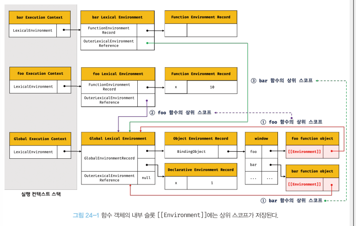

# 24. 클로저

> A closure is the combination of a function and ***the lexical environment within which that function was declared***
> =  클로저는 함수와 그 ***함수가 선언된 렉시컬 환경***과의 조합이다.
> ***
> - MDN
> ***
> > 여기에서 중요한 말은 ***함수가 선언된 렉시컬 환경***이라는 표현
> > 그리고 자바스크립트가 렉시컬 스코프를 따르는 프로그래밍 언어라는 사실


### 예제 24-01: 내부의 중첩 함수라면 scope에 있는 변수 참조 가능
```Javascript
const x = 1;

function outerFunc() {
    const x = 10;
    function innerFunc() { // innerFunc함수가 outerFunc 함수 내부에서 정의된 중첩 함수이기에 outerFunc 함수 변수에 접근 가능(호출만으로는 부족)
        // 여기서 innerFunc 영역이 outerFunc 내부 변수라는 게 'lexical environment'
        console.log(x); // 10
    }
    innerFunc();
}

outerFunc();
```

### 예제 24-02: 단순 호출로는 내부 변수 접근 불가
```Javascript
const x = 1;

function outerFunc() {
    const x = 10;
    innerFunc(); // 그저 내부 호출일 뿐
}

function innerFunc() { // '선언'은 outerFunc 바깥 -> outerFunc 내부 변수 참조 불가. 전역 변수 들고 옴
    console.log(x); // 1
}
outerFunc();
```

## 24.1 렉시컬 스코프
> 렉시컬 스코프(정적 스코프): 자바스크립트  엔진은 함수를 어디서 호출했는지가 아니라 어디에 정의했는지에 따라 상위 스코프를 결정하는데, 이때 이 상위 스코프

### 예제 24-03
```Javascript
const x = 1;

function foo() { // foo 함수는 전역에서 정의되었으니 전역 함수 = 상위 스코프: 전역
    const x = 10;
    bar(); // 호출 위치는 별 상관 없음. 정의된 위치가 matters
}

function bar() { // bar 함수도 전역에서 정의되었으니 전역 함수 = 상위 스코프: 전역
    console.log(x);
}

foo();
bar();
```

<br>

## 24.2 함수 객체의 내부 슬롯 [[Environment]]
> 렉시컬 스코프가 가능하려면 어떻게 해야 할까?
> > 자신이 호출되는 환경과는 상관없이, 정의된 환경(상위 스코프)이 어디였는지 정보값이 있어야 한다
> > * 이 정보값을 항상 들고 다닌다 -> 내부 슬롯에 보관 -> 이 내부 슬롯이 [[Environment]]
> * 함수 정의가 평가되어 함수 객체를 생성하는 시점 = 함수가 정의된 환경 = 상위 함수가 평가/실행되고 있는 시점
>   * 이때 현재 실행 중인 실행 컨텍스트는 상위 함수의 실행 컨텍스트
>   * (예) 전역에서 정의된 함수 선언문 -> 전역 코드가 평가되는 시점에 평가, 함수 객체 생성<br>이 녀석의 Environment는 전역 코드 평가 시점에 실행 중인 실행 컨텍스트의 렉시컬 환경인 전역 렉시컬 환경의 참조가 자연스럽게 저장됨
>   * 함수 객체는 자신이 존재하는 한 [[Environment]]에 저장한 렉시컬 환경의 참조(상위 스코프)를 기억한다.

### 예제 24-04: 렉시컬 스코프 예제 복습
```Javascript
const x = 1;
function foo() {
    const x = 10;
    bar(); // bar의 호출 환경과 bar의 상위 스코프는 관계없음 // 상위 스코프는 함수 정의 환경(위치)에 따라 결정되기 때문
}

function bar() { // 함수 bar는 전역에서 생성됐으니 상위 스코프 = 전역 렉시컬 환경 // 이 정보는 내부슬롯 [[Environment]]에 들어있음
    console.log(x);
}

foo();
bar();
```

### 그림 24-1: 함수 객체의 내부 슬롯[[Environment]]에는 상위 스코프가 저장된다.


* 렉시컬 스코프의 실체?

  * foo함수, bar함수의 상위 스코프는 *전역* -> [[Environment]]에 저장된 상태(전역 렉시컬 환경 참조) & 두 함수는 전역 객체 window의 메서드
  0. 함수 호출
  1. 함수 내부로 코드 제어권 이동
  2. 함수 코드 평가 시작

  * 함수 코드 평가 단계
  1. 함수 실행 컨텍스트 생성
  2. 함수 렉시컬 환경 생성
     1. 함수 환경 레코드 생성
     2. this 바인딩
     3. 외부 렉시컬 환경에 대한 참조 결정 <- 이때 [[Environment]]에 저장된 전역 렉시컬 환경 참조가 할당됨 

<br>

## 24.3 클로저와 렉시컬 환경

> 클로저(closure): 외부 함수보다 중첩 함수가 더 오래 유지되는 경우, 중첩 함수는 이미 생명 주기가 종료된 외부 함수의 변수를 참조할 수 있다.<br>이때, 이 중첩 함수를 클로저라고 칭한다.

### 예제 24-05: 좀비 변수 x?
```Javascript
const x = 1;

function outer() {
    const x = 10;
    const inner = function() {console.log(x)};
    return inner;
}

const innerFunc = outer();
innerFunc(); // innerFunc() 실행 -> const innerFunc에서 outer함수 호출 
// -> const inner 선언하면서 console.log(x); 찍고 (이때 x = 10이라 10 출력) 
// return값으로 희한하게도 단순 변수값이 아니라 함수를 할당한 변수를 반환함
// 여기(innerFunc() <- outer() 반환값)서 outer 함수 안에서만 선언됐던 변수 x 에 할당된 값 10이 찍혀나옴
```

* x는 지역 변수지만 innerFunc()에서 변수값이 찍혀나옴. 
  * 실행 컨텍스트 스택에서 제거된 x가 부활이라도 한 것처럼 동작?
    * ***실행 컨텍스트는 지워져도 렉시컬 환경까지 소멸하는 것은 아님***
  * 함수 선언 변수 inner는 평가될 때 상위 스코프릃 [[Environment]] 내부 슬롯에 저장했고, 이는 함수가 존재하는 한 유지됨

### 그림 24-2: 전역 함수 객체의 상위 스코프 결정(예제 24-05 원리 설명)


### 그림 24-3: 중첩 함수의 상위 스코프 결정(예제 24-05 원리 설명)


### 그림 24-4: 실행 컨텍스트가 제거되어도 렉시컬 환경은 유지가 돼~(예제 24-05 원리 설명 - outer함수)


### 그림 24-5: 그래서 외부 함수가 소멸해도, 반환된 중첩 함수는 외부 함수의 변수를 참조 가능


<br>

### 예제 24-06: 이 코드를 브라우저에서 디버깅 모드로 실행하면...?
```html
<!DOCTYPE html>
<html>
<body>
<script>
    function foo() {
        const x = 1;
        const y = 2;

        // 일반적으로 클로저라고 하지 않는다.
        function bar() {
            const z = 3;

            debugger;
            // 상위 스코프의 식별자를 참조하지 않는다.
            console.log(z);
        }

        return bar;
    }

    const bar = foo();
    bar();
</script>
</body>
</html>
```

### 그림 24-6: 이렇게 됩니다(상위 스코프의 어떤 식별자도 참조하지 않는 함수는 클로저가 아니다...)


* 참조하지도 않는 식별자를 기억하는 건 메모리 낭비 -> 그래서 대부분의 *모던* 브라우저는 최적화를 통해 상위 스코프를 기억하지 못하게 정리
* 따라서 bar 함수는 클로저가 **아니다**


<br>

### 예제 24-07
```html
<!DOCTYPE html>
<html>
<body>
  <script>
    function foo() {
      const x = 1;

      // bar 함수는 클로저였지만 곧바로 소멸한다.
      // 이런 부류의 함수는 일반적으로 클로저라고 하지 않는다.
      function bar() {
        debugger;
        // 상위 스코프의 식별자를 참조한다. (24-06과 다른 점)
        console.log(x);
      }
      bar();
    }

    foo();
  </script>
</body>
</html>
```

### 그림 24-7: 그래도 중첩함수 bar가 클로저가 아닌(?) 이유: 클로저'였'지만 외부 함수보다 일찍 소멸되기 때문에 본질에 부합X
* 클로저'였'지만 같은 건 일반적으로 클로저라고 부르지 않는다


<br>


### 예제 24-08: 이번엔 클로저에 해당되는 예
```html
<!DOCTYPE html>
<html>
<body>
  <script>
    function foo() {
      const x = 1;
      const y = 2;

      // 클로저
      // 중첩 함수 bar는 외부 함수보다 더 오래 유지되며 상위 스코프의 식별자를 참조한다.
      function bar() {
        debugger;
        console.log(x);
      }
      return bar;
    }

    const bar = foo();
    bar();
  </script>
</body>
</html>
```

### 그림 24-8: 중첩 함수 bar는 외부 함수보다 더 오래 유지되는 데다 상위 스코프의 식별자를 참조함. 그러므로 클로저


> ***클로저는 (1) 중첩 함수가 상위 스코프의 식별자를 참조하고 있고 (2) 중첩 함수가 외부 함수보다 더 오래 유지되는 경우에 한정하는 것이 일반적***

* 클로저인 중첩 함수 bar는 상위 스코프 x, y 식별자 중에서 x만 참조하는데, 이런 경우 참조하고 있는 식별자만 기억하게 됨(메모리 낭비니까... by 대부분의 브라우저)

> **자유 변수(free variable)**: 클로저에 의해 참조되는 상위 스코프의 변수
> * 클로저는 어찌 보면 자유 변수에 묶여있는 함수라 불릴 수도 있음
>   * closure: 함수가 자유 변수에 대해 closed 상태

<br>

## 24.4 클로저의 활용

* 상태를 안전하게 변경하고 유지하기 위해 사용<br>= 상태를 안전하게 은닉(information hiding)하고 특정 함수에게만 상태 변경을 허용하기 위해 사용

### 예제 24-09
```Javascript
let num = 0; // 변수 : 카운트 상태

const increase = function () { // 함수: 카운트 상태 변경 -> increase 함수 호출 전까지 num 유지할 필요 있음(num은 increase만 변경하는 게 허용)
    // 하지만 위에서는 num이 전역 변수로 선언되었기에 힘듬 -> 이때 클로저를 활용해보자!(예제 24-10에 계속)
  return ++num; // 증가를 시킨 다음에 반환?
};

console.log(increase()); // 1
console.log(increase()); // 2
console.log(increase()); // 3
```

### 예제 24-10
```Javascript
// 카운트 상태 변경 함수
const increase = function () {
  // 카운트 상태 변수
  let num = 0;

  // 카운트 상태를 1만큼 증가시킨다.
  return ++num;
};

// 이전 상태를 유지하지 못한다(increase를 쓰는 의의가 없음...). -> 이전 상태를 유지할 수 있도록 클로저를 다시 활용해보자(예제 24-11)
console.log(increase()); // 1
console.log(increase()); // 1
console.log(increase()); // 1
```

### 예제 24-11: 의도한 대로 클로저 적용 성공! increase 함수 편
```Javascript
// 카운트 상태 변경 함수
const increase = (function () {
  // 카운트 상태 변수
  let num = 0; // 초기화를 클로저 바깥에서 시킴으로써 무한 초기화 문제 해결

  // 클로저
  return function () {
    // 카운트 상태를 1만큼 증가 시킨다.
    return ++num;
  };
}());

console.log(increase()); // 1
console.log(increase()); // 2
console.log(increase()); // 3
```

### 예제 24-12: increase에 성공했으니 decrease 함수에도 적용해보자
```Javascript
const counter = (function () {
  // 카운트 상태 변수
  let num = 0;

  // 클로저인 메서드를 갖는 객체를 반환한다.
  // 객체 리터럴은 스코프를 만들지 않는다.
  // 따라서 아래 메서드들의 상위 스코프는 즉시 실행 함수의 렉시컬 환경이다.
  return {
    // num: 0, // 프로퍼티는 public하므로 은닉되지 않는다.
    increase() {
      return ++num;
    },
    decrease() {
      return num > 0 ? --num : 0;
    }
  };
}());

console.log(counter.increase()); // 1
console.log(counter.increase()); // 2

console.log(counter.decrease()); // 1
console.log(counter.decrease()); // 0
```
* increase/decrease 메서드가 어디에서 호출되건 increase, decrease 함수는 즉시 실행 함수 스코프의 식별자를 참조할 수 있다.


### 예제 24-13: 예제 24-12 생성자 함수로 표현해보기
```Javascript
const Counter = (function () {
  // ① 카운트 상태 변수
  let num = 0;

  function Counter() {
    // this.num = 0; // ② 프로퍼티는 public하므로 은닉되지 않는다.
  }

  Counter.prototype.increase = function () {
    return ++num;
  };

  Counter.prototype.decrease = function () {
    return num > 0 ? --num : 0;
  };

  return Counter;
}());

const counter = new Counter();

console.log(counter.increase()); // 1
console.log(counter.increase()); // 2

console.log(counter.decrease()); // 1
console.log(counter.decrease()); // 0
```
* 즉시 실행 함수 내에서 선언된 num 변수는 인스턴스를 통해 접근 불가 & 즉시 실행 함수 외부에서도 접근 불가한 은닉된 변수
* Counter(생성자 함수)는 프로토타입으로 increase, decrease 메서드를 상속받는 인스턴스를 생성하고, 이분들은 클로저라 프로토타입을 통해 상속되는 프로토타입 메서드여도 즉시 실행함수 자유변수 num 참조 가능<br>num 변수 값은 increase, decrease 메서드만 변경 가능

### 예제 24-14: 함수형 프로그래밍과 클로저
```Javascript
// 함수를 인수로 전달받고 함수를 반환하는 고차 함수
// 이 함수는 카운트 상태를 유지하기 위한 자유 변수 counter를 기억하는 클로저를 반환한다.
function makeCounter(aux) {
  // 카운트 상태를 유지하기 위한 자유 변수
  let counter = 0;

  // 클로저를 반환
  return function () {
    // 인수로 전달 받은 보조 함수에 상태 변경을 위임한다.
    counter = aux(counter);
    return counter;
  };
}

// 보조 함수
function increase(n) {
  return ++n;
}

// 보조 함수
function decrease(n) {
  return --n;
}

// 함수로 함수를 생성한다.
// makeCounter 함수는 보조 함수를 인수로 전달받아 함수를 반환한다
const increaser = makeCounter(increase); // ①
console.log(increaser()); // 1
console.log(increaser()); // 2

// increaser 함수와는 별개의 독립된 렉시컬 환경을 갖기 때문에 카운터 상태가 연동하지 않는다.
const decreaser = makeCounter(decrease); // ②
console.log(decreaser()); // -1
console.log(decreaser()); // -2
```
* makeCounter 함수를 호출 -> 반환된 함수는 자신만의 독립된 렉시컬 환경을 가짐<br>함수를 호출할 때마다 새로운 makeCounter 함수 실행 컨텍스트의 렉시컬 환경이 생성


### 그림 24-9: makeCounter 함수를 처음 호출했을 때 생성된 렉시컬 환경


### 그림 24-10: makeCounter 함수를 두 번째로 호출했을 때 생성된 렉시컬 환경


* 독립된 카운터가 아니라 연동 -> 증감 가능한 카운터를 만들려면 **렉시컬 환경을 공유**하는 클로저를 만들어야 한다<br>이러려면 makeCounter 함수 두 번 호출 금지


### 예제 24-15
```Javascript
// 함수를 반환하는 고차 함수
// 이 함수는 카운트 상태를 유지하기 위한 자유 변수 counter를 기억하는 클로저를 반환한다.
const counter = (function () {
  // 카운트 상태를 유지하기 위한 자유 변수
  let counter = 0;

  // 함수를 인수로 전달받는 클로저를 반환
  return function (aux) {
    // 인수로 전달 받은 보조 함수에 상태 변경을 위임한다.
    counter = aux(counter);
    return counter;
  };
}());

// 보조 함수
function increase(n) {
  return ++n;
}

// 보조 함수
function decrease(n) {
  return --n;
}

// 보조 함수를 전달하여 호출
console.log(counter(increase)); // 1
console.log(counter(increase)); // 2

// 자유 변수를 공유한다.
console.log(counter(decrease)); // 1
console.log(counter(decrease)); // 0
```

<br>

## 24.5 캡슐화와 정보 은닉
## 24.6 자주 발생하는 실수