# 36. 디스트럭처링 할당

> ***<big>디스트럭처링 할당(destructuring assignment, 구조 분해 할당)</big>***
> ***
> 구조화된 이터러블(예: 배열) 또는 객체를 destructuring(비구조화/구조 파괴)하여 1개 이상의 변수에 개별적으로 할당하는 것
> * 이터러블(예: 배열)/객체 리터럴에서 필요한 값만 추출하여 변수에 할당할 때 유용

<br>

## 36.1 배열 디스트럭처링 할당

#### 예제 36-01: ES5에서 구조화된 배열 -> 디스트럭처링 -> 1+개 변수 할당하던 방법
```Javascript
var arr = [1, 2, 3];

var one = arr[0];
var two = arr[1];
var three = arr[2];

console.log(one, two, three); // 1 2 3
```

<br>

#### 예제 36-02: ES6 배열 디스트럭처링 할당
```Javascript
const arr = [1, 2, 3];

const [one, two, three] = arr;
console.log(one, two, three); // 1 2 3
```
* 할당의 대상(우변)은 이터러블이어야 한다
* 할당 기준은 배열의 인덱스다(=순서대로 할당된다)

<br>

#### 예제 36-03: 배열 디스트럭처링 할당 방법(할당 연산자 왼쪽)
```Javascript
const [x, y] = [1, 2];
```
* 할당 연산자 왼쪽에 값을 할당받을 변수를 선언해야 함
  * 이 변수는 ***배열 리터럴 형태***로 선언

<br>

#### 예제 36-04: 변수를 배열 리터럴 형태로 선언만 하고 우변에 이터러블 선언을 빼놓으면 에러 발생
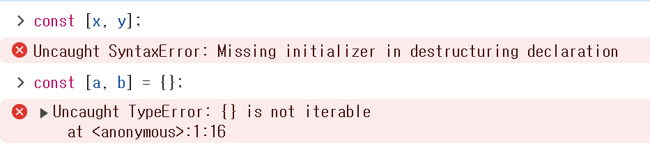


<br>
<br>

#### 예제 36-05: 배열 디스트럭처링 할당의 변수 선언문 > 선언/할당 분리 가능(권장X)
```Javascript
let x, y;
[x, y] = [1, 2];
```
* `const`키워드 사용 불가 -> 권장X
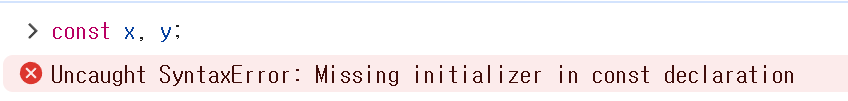

<br>

#### 예제 36-06: 배열 디스트럭처링 할당 기준은 배열의 인덱스라 순서대로 할당됨<br>***※ 변수 개수와 이터러블 요소 개수가 반드시 일치할 필요는 없음***
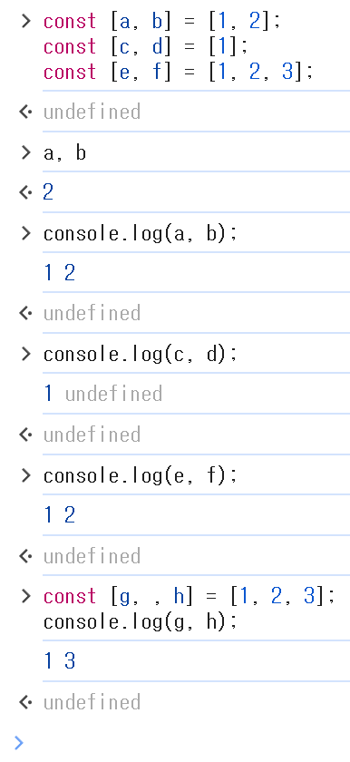

<br>
<br>

#### 예제 36-07: 배열 디스트럭처링 할당 위한 변수에 기본값 설정 가능
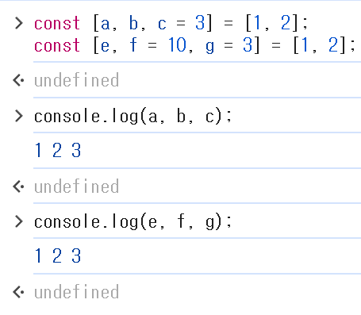

<br>
<br>

#### 예제 36-08: 배열 디스트럭처링 할당은 (배열과 같은) 이터러블에서 필요한 요소만 추출하여 변수에 할당할 때 유용하다
* URL 파싱 -> protocol, host, path property 갖는 객체 생성해 반환함
  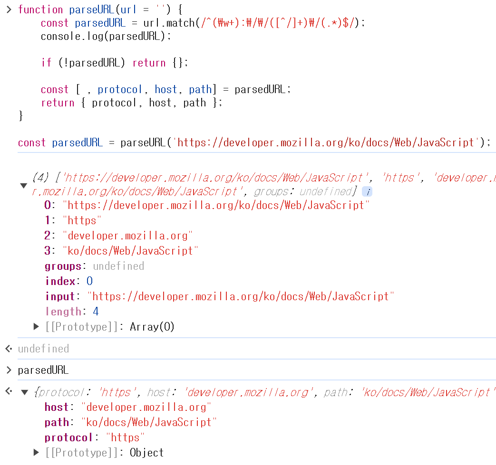

<br>
<br>

#### 예제 36-09
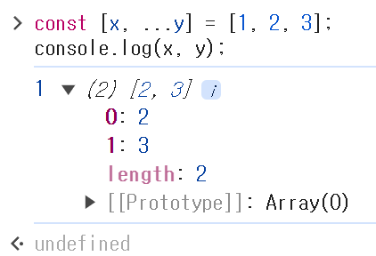

<br>
<br>

## 36.2 객체 디스트럭처링 할당

#### 예제 36-10: ES5에서 객체의 각 프로퍼티를 객체로부터 destructuring하여 변수에 할당하기 위해서는 ***프로퍼티 키를 사용***해야 한다.
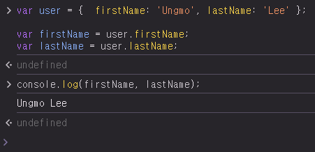

<br>
<br>

#### 예제 36-11: ES6의 객체 destructuring 할당은 객체의 각 property를 객체로부터 추출하여 1개 이상의 변수에 할당한다.
* 이때 할당 대상(우변)은 객체여야 하며
* 할당 기준은 ***프로퍼티 키***다.
  * 순서는 의미가 없으며
  * 선언된 변수 이름과 프로퍼티 키가 일치하면 할당된다.

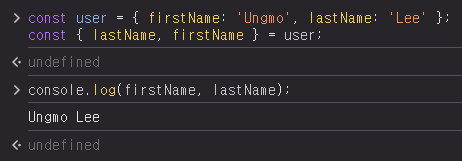

<br>
<br>

#### 예제 36-12: (배열 destructuring 할당과 마찬가지로) 객체 destructuring 할당을 위해서는 할당 연산자 왼쪽에 프로퍼티 값을 할당받을 변수를 선언해야 한다.
* 이때 변수를 *객체 리터럴 형태*로 선언한다.
```Javascript
const { lastName, firstName } = { firstName: 'Ungmo', lastName: 'Lee' };
```

<br>

#### 예제 36-13: 우변에 객체/객체로 평가될 수 있는 표현식(문자열/숫자/배열 등)을 할당하지 않으면 에러가 발생한다.

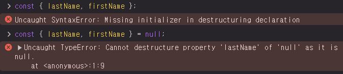

<br>
<br>

#### 예제 36-14: 프로퍼티 축약 표현을 통해 변수 선언해보기
```Javascript
const { lastName, firstName } = user;
const { lastName: lastName, firstName: firstName } = user;
```

<br>

#### 예제 36-15: 객체의 프로퍼티 키와 다른 변수 이름으로 프로퍼티 값을 할당받으려면 다음과 같이 변수를 선언해야 한다.
```Javascript
const user = { firstName: 'Ungmo', lastName: 'Lee' };

// property key(lastName, firstName)을 기준으로 destructuring allocation 일어남
const { lastName: ln, firstName: fn } = user; // user에서 property key가 lastName인 property value를 ln이란 변수에 할당 && user에서 property key가 firstName인 property value를 변수 fn에 할당한다.

console.log(fn, ln); // Ungmo Lee
```

<br>

#### 예제 36-16: 객체 destructuring 할당을 위한 변수에 기본값 설정 가능

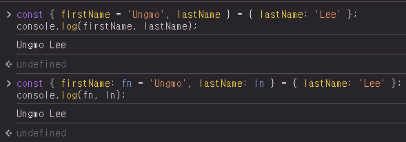

<br>
<br>

#### 예제 36-17: 객체 destructuring allocation은 객체에서 property key로 필요한 property value만 추출하여 변수에 할당하고 싶을 때 유용하다

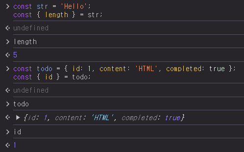

<br>
<br>

#### 예제 36-18: 객체 destructuring 할당은 객체를 인수로 전달받는 함수의 매개변수에도 사용 가능하다

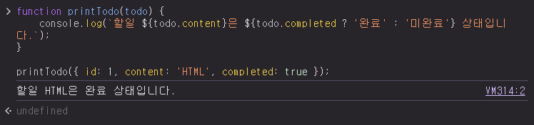

<br>
<br>

#### 예제 36-19: 36-18 예제에서 객체를 인수로 전달받는 매개변수 todo에 대해 객체 destructuring 할당을 사용하면 좀 더 간단하고 가독성 좋게 표현 가능하다

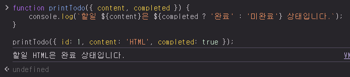

<br>
<br>

#### 예제 36-20: 배열 요소가 객체인 경우 배열 destructuring 할당과 객체 destructuring 할당을 혼용 가능하다

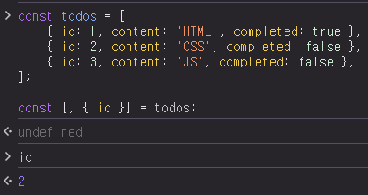

<br>
<br>

#### 예제 36-21: 중첩 객체

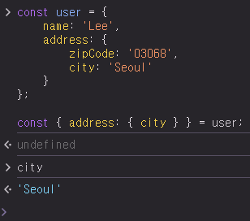

<br>
<br>

#### 예제 36-22: 객체 destructuring allocation 위한 변수에 Rest Property `...`도 사용 가능하다
* Rest property는 Rest parameter나 Rest 요소처럼 반드시 *마지막*에 위치해야 한다.
  * Rest Property는 2021.1 기준 TC39 process의 stage 4 단계에 제안된 상태

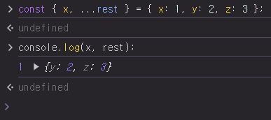

<br>
<br>

