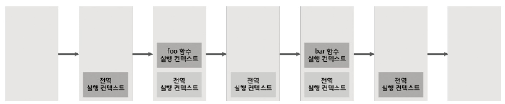
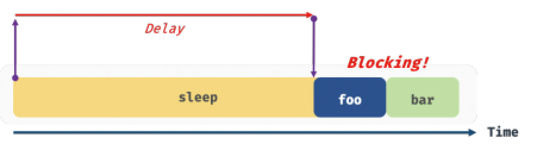
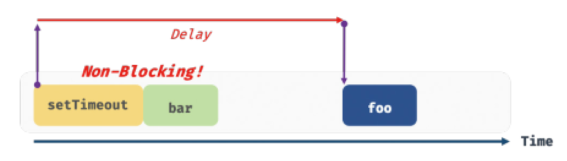
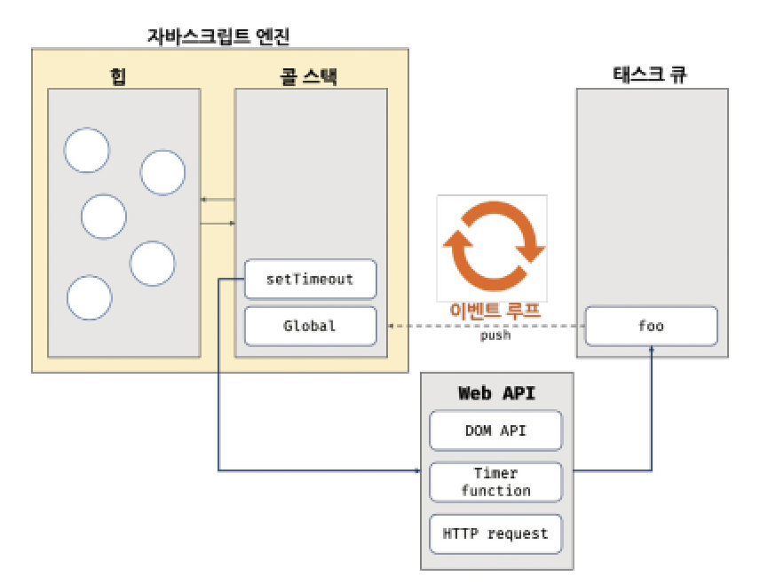

# 42. 비동기 프로그래밍
## 42.1 동기 처리와 비동기 처리

#### 예제 42-01: foo함수, bar함수 호출시 실행 컨텍스트 stack 분석
```Javascript
const foo = () => {};
const bar = () => {};

foo();
bar();
```

<br>

#### 그림 42-1: 실행 컨텍스트 스택

> 자바스크립트 엔진은 단 하나의 실행 컨텍스트 스택을 가짐
> <br>그리고 함수의 실행 순서는 실행 컨텍스트 스택으로 관리됨
> * 일명 싱글 스레드(single thread) 방식으로 동작
> * 처리에 시간이 걸리는 태스크를 실행할 경우 블로킹(blocking, 작업 중단) 발생



1. (아무것도 없는 상태)
2. 전역 실행 컨텍스트 push
3. foo 함수 호출 -> foo 함수 실행 컨텍스트 push
4. foo 함수 실행 컨텍스트 pop
5. bar 함수 호출 -> bar 함수 실행 컨텍스트 push
6. bar 함수 실행 컨텍스트 pop
7. 전역 실행 컨텍스트 pop
***
* 실행 컨텍스트 스택에 함수 실행 컨텍스트 push = 함수 실행 시작

<br>

***

#### 예제 42-02: 일정 시간이 경과한 이후 콜백 함수 호출하는 `sleep`함수 구현해보기
```Javascript
// sleep 함수는 일정 시간(delay)이 경과한 이후에 콜백 함수(func)를 호출한다.
function sleep(func, delay) {
  // Date.now()는 현재 시간을 숫자(ms)로 반환한다.("30.2.1. Date.now" 참고)
  const delayUntil = Date.now() + delay;

  // 현재 시간(Date.now())에 delay를 더한 delayUntil이 현재 시간보다 작으면 계속 반복한다.
  while (Date.now() < delayUntil);
  // 일정 시간(delay)이 경과한 이후에 콜백 함수(func)를 호출한다.
  func();
}

function foo() {
  console.log('foo');
}

function bar() {
  console.log('bar');
}

// sleep 함수는 3초 이상 실행된다.
sleep(foo, 3 * 1000);
// bar 함수는 sleep 함수의 실행이 종료된 이후에 호출되므로 3초 이상 블로킹된다.
bar();
// (3초 경과 후) foo 호출 -> bar 호출
```

<br>

#### 그림 42-2: 동기(synchronous) 처리 - one at a time



<br>

#### 예제 42-02 `setTimeout` 타이머 함수로 수정해보기
```Javascript
function foo() {
  console.log('foo');
}

function bar() {
  console.log('bar');
}

// 타이머 함수 setTimeout은 일정 시간이 경과한 이후에 콜백 함수 foo를 호출한다.
// 타이머 함수 setTimeout은 bar 함수를 블로킹하지 않는다.
setTimeout(foo, 3 * 1000);
bar();
// bar 호출 -> (3초 경과 후) foo 호출
```

<br>

#### 그림 42-3: 비동기(asynchronous) 처리


* 장점: 블로킹 발생X
* 단점: 태스크 실행 순서 보장X
* 단점2: 비동기 처리 위한 콜백 패턴은 콜백 헬(callback hell)을 발생시켜 가독성을 나쁘게 함
* 단점3: 비동기 처리 중 발생한 에러 예외 처리가 곤란함
* 단점4: 여러 개의 비동기 처리를 한 번에 처리하는 데도 한계가 있음

***

> * 타이머 함수인 `setTimeout`, `setInterval`, HTTP 요청, 이벤트 핸들러는 비동기 처리 방식으로 동작
> * 비동기 처리는 이벤트 루프, 태스크 큐와 깊은 관계 있음

<br>
<br>

***

## 42.2 이벤트 루프와 태스크 큐

> 이벤트 루프(event loop)
> ***
> 자바스크립트의 동시성(concurrency)을 지원해주는 일종의 브라우저 내장 기능
> * (예) HTML 요소가 애니메이션 효과를 통해 움직이면서 이벤트 처리, HTTP 요청을 통해 서버로부터 데이터를 가지고 오면서 렌더링...

<br>

#### 그림 42-4: 이벤트 루프와 브라우저 환경


<br>
<br>

> 대부분의 자바스크립트 엔진은 크게 2개의 영역으로 구분 가능
> <br>그리고 태스크가 요청되면 콜 스택을 통해 요청된 작업을 순차적으로 실행함

1. 콜 스택(call stack): 실행 컨텍스트 스택
   * 함수를 호출하면 해당 함수의 실행 컨텍스트가 순차적으로 콜 스택에 push 되어 순차적으로 실행됨
   * 자바스크립트는 단 하나의 콜 스택만 사용
2. 힙(heap): 객체가 저장되는 메모리 공간
   * 콜 스택의 요소인 실행 컨텍스트는 힙에 저장된 객체를 참조함
   * 메모리에 값을 저장하려면 먼저 값을 저장할 메모리 공간의 크기를 결정해야 하는데, 객체는 할당해야 할 메모리 공간의 크기를 런타임에 결정(동적 할당)해야 한다.
     * 객체는 원시 값과는 달리 크기가 처음부터 정해지지 않았기 때문
   * 따라서 객체가 저장되는 메모리 공간인 힙 또한 *구조화*되어있지 않음

***

> 비동기 처리에서 소스코드의 평가/실행 제외한 모든 처리는 자바스크립트 엔진 구동 환경인 브라우저 또는 Node.js가 처리함
> * (예) 비동기 방식으로 동작하는 `setTimeout` 콜백 함수의 평가와 실행은 자바스크립트 엔진 담당,<br>호출 스케줄링을 위한 타이머 설정, 콜백 함수 등록은 브라우저/Node.js가 담당
> > 이것을 위해 브라우저 환경이 제공하는 것들이 ***태스크 큐***와 ***이벤트 루프***

1. 태스크 큐(task queue/callback queue): 비동기 함수(`setTimeout`, `setInterval` 등)의 콜백 함수 또는 이벤트 핸들러가 일시적으로 보관되는 영역
   * 태스크 큐와 별도 개념인 마이크로테스트 큐도 존재
     * 프로미스의 후속 처리 메서드의 콜백 함수가 일시적으로 보관
2. 이벤트 루프(event loop)
   1. 콜 스택에 현재 실행 중인 실행 컨텍스트가 있는지, 태스크 큐에 대기 중인 함수(콜백 함수, 이벤트 핸들러 등)가 있는지 반복해서 확인
   2. 콜 스택이 비어있고 태스크 큐에 대기중인 함수가 있다면 이벤트 루프는 순차적(FIFO)로 태스크 큐에 대기 중인 함수를 콜 스택으로 이동시킴
   3. 이때 콜 스택으로 이동한 함수는 실행됨
      * 즉, 태스크 큐에 일시 보관된 함수는 비동기 처리 방식으로 동작하는 꼴

<br>

#### 예제 42-04: foo 함수, bar 함수 중에서 어떤 게 먼저 실행될까?
```Javascript
function foo() {
  console.log('foo');
}

function bar() {
  console.log('bar');
}

setTimeout(foo, 0); // 0초(실제는 4ms) 후에 foo 함수가 호출된다.
bar();
```

1. 전역 코드가 평가되어 전역 실행 컨텍스트 생성 -> 콜 스택에 push
2. 전역 코드 실행 시작, `setTimeout` 함수 호출 -> `setTimeout` 함수 실행 컨텍스트 생성, 콜 스택에 push = 현재 실행 중인 실행 컨텍스트가 됨
   * 브라우저의 Web API(호스트 객체)인 타이머 함수도 함수이므로 함수 실행 컨텍스트를 생성
3. `setTimeout` 함수가 실행되면 콜백 함수를 호출 스케줄링하고 종료됨 -> 콜 스택에서 pop
   * 이때 브라우저의 역할: 호출 스케줄링(=타이머 설정과 타이머)이 만료되면 콜백 함수를 태스크 큐에 push
4. 브라우저 실행 작업(4-ⅰ)과 자바스크립트 엔진이 수행하는 작업(4-ⅱ)은 병행 처리됨
    1. (브라우저)
       1. 타이머를 설정하고 타이머의 만료를 기다림
       2. 타이머가 만료되면 콜백 함수 foo가 task queue 에 push
          * 지연 시간이 4ms 이하인 경우 최소 지연 시간 4ms 지정
       3. 최소 지연 시간 4ms에 해당하는 경우이므로 4ms 후에 콜백 함수 foo가 task queue에 push, 대기하게 됨
    > `setTimeout` 함수로 호출 스케줄링한 콜백 함수는 정확히 지정한 지연 시간 이후에 호출된다는 보장 없음 
    2. (자바스크립트 엔진)
       1. bar 함수 호출
       2. bar 함수 실행 컨텍스트 생성, 콜 스택에 push = 현재 실행 중인 실행 컨텍스트가 됨
       3. bar 함수 종료, 콜 스택에서 pop
          * 이때 브라우저가 타이머를 설정한 후 4ms가 경과했다면 foo 함수는 아직 task queue에서 대기 중
5. 전역 코드 실행이 종료, 전역 실행 컨텍스트가 콜 스택에서 pop
   * pop 됨으로써 콜 스택에는 아무런 실행 컨텍스트도 없게 됨
6. 이벤트 루프에 의해 콜 스택이 비어있음이 감지, task queue에서 대기 중인 콜백 함수 foo가 이벤트 루프에 의해 call stack에 push<br>(=콜백 함수 foo의 함수 실행 컨텍스트 생성 & 콜 스택에 푸시 -> 현재 실행 중인 실행 컨텍스트가 됨)<br>이후 foo 함수 종료, 콜 스택에서 pop

> 비동기 함수인 `setTimeout`의 콜백 함수는 task queue에 push되어 대기하다가<br>call stack이 비게 되면(=전역 코드 및 명시적으로 호출된 함수가 모두 종료되면) 비로소 call stack에 push 되어 실행됨
> ***
> 자바스크립트는 싱글 스레드 방식으로 동작? 정확히는 (브라우저에 내장된) 자바스크립트 엔진이 그렇고 브라우저는 멀티 스레드로 동작
> * 만약 모든 자바스크립트 코드가 자바스크립트 엔진에서 싱글 스레드 방식으로 동작한다면 자바스크립트는 비동기 동작이 불가능(즉 아니라는 뜻)